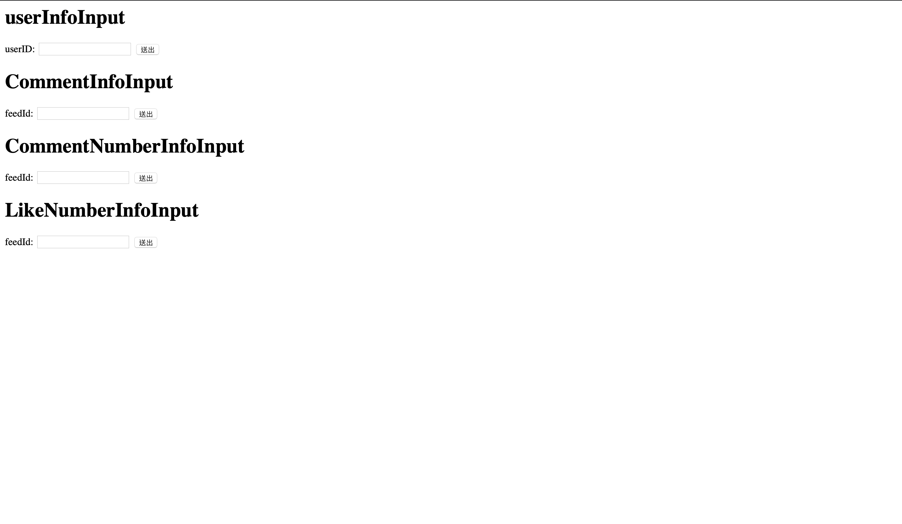

# JmesterWeb


<a href=""></a>

## Install


Before installing, download and install [docker](https://www.docker.com) , docker-compose.

```sh
$ git clone https://github.com/skysora/JmesterWeb.git
$ cd ./JmesterWeb/laradock
$ docker-compose up --build nginx mysql
```
You cane access http://127.0.0.1 address:8000
